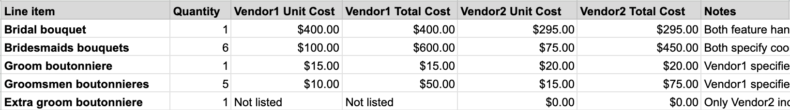
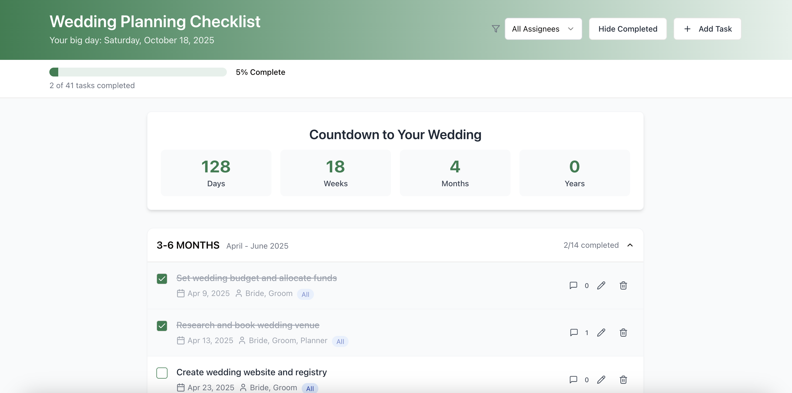

import Aside from '../../components/Aside.astro';
import geminiImg from '../../assets/wedding/welcome-bag-gemini.png';
import chatgptImg from '../../assets/wedding/welcome-bag-chatgpt.png';
import floralMidjourneyImg from '../../assets/wedding/floral-inspiration-midjourney.png';
import floralRealImg from '../../assets/wedding/real-flowers.png';

There's tons of content on the internet about wedding planning, but almost none about wedding planning with AI. To the degree the topic is mentioned, it's often in a [negative light](https://www.reddit.com/r/wedding/comments/1jl8sm1/are_ai_tools_helpful_for_planning_my_wedding/), rather than a constructive one.

With that in mind, I wanted to share some of the realistic, practical ways I've used AI to help with wedding planning, including prompts.

Hopefully this can be helpful to future couples!

## Ways I've Used AI for Wedding Planning
### Comparing vendor quotes

All of us are working within budgets and want to make sure we're spending wisely. But vendor quotes come in all formats - PDFs, Excel sheets, emails, etc. None of the line items match up, the wording is different for each vendor, and fees vary widely. It's a mess, and it makes it really hard to answer the questions that should be simple: 
- Which one of these vendors is more expensive, apples to apples? 
- What's making one more expensive than the other?
- What could I remove or change to most effectively cut costs?

I've found AI to be hugely helpful at answering these kinds of questions. 

I've been uploading vendor quotes to ChatGPT and asking it to help me cross-compare the quotes. I still double-check everything, but it saves so much time building a side-by-side comparison. Here's the prompt I used for floral quotes, for example:

<Aside type="info">
  Extract the data from each of these two invoices and perform a matching exercise to find corresponding line items between them and compare prices. 

Your resulting output should be a table in csv format with columns:
* Line item
* Quantity
* For each vendor: unit cost, total cost
* Any notes on sources of difference or discrepancies

For example:
Line item, Quantity, Vendor1 Unit Cost, Vendor1 Total Cost, Vendor2 Unit Cost, Vendor2 Total Cost, Notes Bridal bouquet, 1, $295, $295, $400, $400, Both feature vibrant bouquets with similar flowers. 
</Aside>

<i>(This is called 'one-shot' prompting, because I provide the AI with one example of a correct line item based on the inputs. If you provide a multiple examples ('few-shot' prompting), your results will be even more accurate.)</i>

Here's a sample of the anonymized output:

It's not perfect (AI still makes mistakes sometimes, and the spreadsheet doesn't have working formulas) but it's faster and more accurate than if I had started from scratch. Plus, you can then 'chat with the vendor quotes' in the same thread to help answer questions about the contracts or help draft an email response to the vendors.

### Visualizing Wedding Design and Florals

I find that vendor conversations can be quicker and more productive when I use AI image generation as a tool to convey my vision. ChatGPT 4-o image generation is particularly fantastic, but Midjourney and Gemini are great too. 

Here's an example prompt I used while I was exploring possible color palettes for bridesmaids dresses and flowers: 

<Aside type="info">
  Photo of bridesmaids, some white and some indian, wearing dresses in different shades of red, orange, yellow. sunset colors. silky materials and different dress styles. they hold vibrant red, orange, and yellow bouquets with sunflowers and queen anne's lace. summer colors, bright.
</Aside>

And the results; this was a few months ago, so I used Midjourney, which generates 4 images per prompt to show different variations:

Seeing these comparsions of different flower and dress combos ultimately led me to the design inspiration image I picked, also generated by Midjourney. When I brought this to our florist, she immediately understood the vision. Here's a side-by-side with the real flowers from our design session last week: 

  
  

Because I was able to show here a picture not just of other weddings, but actually of what I wanted, she was able to execute my vision flawlessly, and I felt confident that were were communicating clearly.

### Vibe-Coding a Custom Wedding Checklist Website

I've been really frustrated with the available 'wedding checklist' options. Tools like AislePlanner or Wedsites require authentication, which is hard for parents. Google Sheets isn't mobile-friendly and isn't very visual.

So, I set out to create my own custom wedding checklist that met my specific needs, using Replit to 'vibe code' it -- aka coding using natural language prompts.

It took a bit of refinement, but here's a demo of the end result (feel free to add or check off tasks - this isn't my real wedding checklist): [https://wedding-planning-checklist.replit.app/](https://wedding-planning-checklist.replit.app/)

Vibe-coding a custom checklist probably isn't for the faint of heart, but it's a good example of how AI allows you to personalize not just your wedding design images, but also the tools you use for planning. 

### Drafting Wording + Copy

AI is fantastic at anything text-based: wedding website copy, drafts of thank-you notes (before you write them out by hand!), programs, and more.

When using AI to help draft something, context is key. The more you share about the occassion, your desired tone, who the reader will be, and your vision, the better your outcome will be.

Two tactical recommendations here:
- **Voice Mode:** I love using the voice functionality in ChatGPT to dictate a rough draft, then ask ChatGPT to edit and format my ramblings. This is a great way to fit wedding planning into your schedule; you can dictate the 'Things to Do' section of your wedding website while on your commute!
- **Project Folders:** Highly recommend creating a 'folder' to organize your wedding-related chats. You can also use this to add relevant context for the wedding weekend as a whole that applies to all future wedding chats. For example, uploading your Wedding Design Deck or your rough draft of the Wedding Schedule/Timeline to the Project would really improve your output.

### Honeymoon Planning

We also used AI a lot in honeymoon planning. When we were deciding where to go, there were so many factors to think about: time of year, weather, hurricane risk, what kind of trip we wanted. 

Travel blogs typically either cover 'Top 10 places to Honeymoon in X month' or 'Best things to do in Y place', which are helpful but still discrete.

With AI, we could put it all together. Here's an example prompt:

<Aside type="info">
  I'm getting married in October in Napa Valley. I want to plan a honeymoon that is a less than 5 hour flight away from SFO and that will be outdoorsy but chill. I want to be in places with mild or slightly warm weather and with limited risk of big storms or fires. It would be nice to be able to do water-related activities, like surfing or rafting. Suggest 5 relevant destinations and make a comparison table of how they stack up on these factors.
</Aside>

And the output:

If you put something similar into Google, you get places to stay while on a Honeymoon _in San Francisco_, or articles recommending Bali, which is outside the desired distance. AI helps you be much more targeted.

You can then follow this up by using AI Deep Research to plan an itinerary for a specific destination, budget, and dates!

### Stakeholder Alignment!

As an extension of how I used AI to visualize design ideas, I've also found that generating images can be extremely helpful for aligning stakeholders. 

Managing expectations is a critical part of wedding planning, and the thing you most want to avoid is showing up to wedding day and having someone say, "Wait, I didn't know it was going to be like that."

Even for things where there's no vendor involved - like wedding welcome bags for out-of-town guests, which we're preparing ourselves - I've found it really helpful to use AI to visualize the end-result. This makes it much easier for everyone to stay in-the-loop compared to just listing out our plans, and without going all the way to preparing a sample bag.

<Aside type="info">
  Prompt: Create an image of a flatlay for a wedding welcome bag. The paper bag should be white with a green ribbon. Around it, display the contents in an artistic way as a wedding photographer might arrange it: two water bottles, a small thing of tissues that says 'for happy tears', two bags of lays chips, two reeses bars, 2 packets of emergen-c, and a note that says "Welcome to our wedding" with a watercolor landscape drawn on the card.
</Aside>

  <figure style={{ flex: 1, textAlign: 'center' }}>
    
    <figcaption style={{ fontSize: '0.95em', color: '#666', marginTop: '4px' }}>
      Gemini-generated
    </figcaption>
  </figure>
  <figure style={{ flex: 1, textAlign: 'center' }}>
    
    <figcaption style={{ fontSize: '0.95em', color: '#666', marginTop: '4px' }}>
      ChatGPT-generated
    </figcaption>
  </figure>

## Things I Considered Using AI For, But Didn't

There are also a few things I thought about using AI for, but ultimately decided against.

### Wedding Custom GPT / Chatbot

I thought about [making a custom GPT](https://help.openai.com/en/articles/8554397-creating-a-gpt) for our wedding. I would upload our website info, the timeline, FAQs, etc., and then guests could ask it questions. I think it could be really cool, but most guests probably wouldn't use it and would prefer to text us. And honestly, I like it when people text to ask questions - it's a nice touchpoint and helps me know they're thinking about and excited for the wedding.

### Vibe Coding the Wedding Website

I also considered vibe-coding our wedding website from scratch instead of using Zola or another provider. I was excited about the idea, mostly because it would allow a lot of personalization and really beautiful designs. **BUT** I also didn't want to accidentally break something important, particularly the RSVP flow, or, even worse, somehow risk exposing guests' data. 

If you're not doing online RSVPs, or you use a link to another platform, this could be really fun. But I ended up sticking with a safer route, using WedSites for more customization without the vibe-coding risk.

## In Conclusion

There are far more aspects of wedding planning that I did manually without AI than with AI; the personal and human touches are what makes a wedding special!

But, I do also think that planning a wedding is hard, and using AI as a tool can make the budgeting, alignment, and planning a little bit easier.

I hope it's helpful! And if you've used AI for wedding planning in other ways, I'd love to hear about it :)