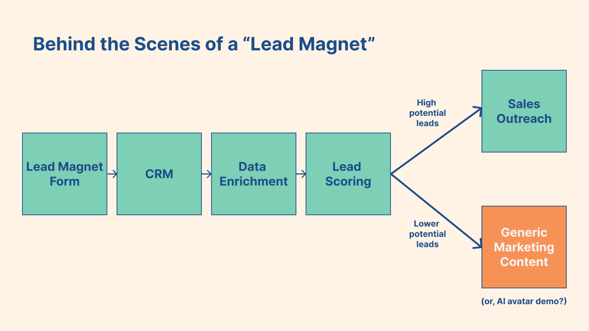
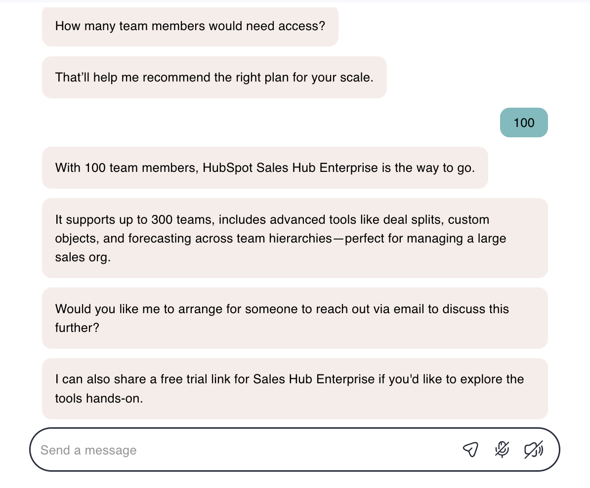

import Tweet from '../../components/Tweet.astro';
import LinkedIn from '../../components/LinkedIn.astro';
import Reddit from '../../components/Reddit.astro';

A few months ago, I came across a marketing campaign that genuinely made me pause. It featured a bold (and, frankly, dystopian) tagline plastered across a billboard in San Francisco: _Stop Hiring Humans_.

<Reddit 
    url="https://www.reddit.com/r/ThatsInsane/comments/1hgcshx/this_aigenerated_billboard_in_san_francisco/"
    showMedia={true}
    theme="light"
/>

The company claims that this was a very intentional play to create awareness through controversy, and, at least in their assessment, [it worked](https://www.artisan.co/blog/stop-hiring-humans).

My initial assessment was that the campaign was both clever and unsettling. And I immediately concluded that no one would ever adopt this.

## Encountering an AI Avatar in the Wild

Fast-forward two months, and I was trying out [Hubspot's AI Search Grader](https://www.hubspot.com/ai-search-grader). I had to enter my email to download my results, a classic lead magnet strategy.

As a brief interlude, if you're unfamiliar with 'lead magnets', let's go behind the scenes of how they work. In addition to 'put in your email to get the results', other classic examples of lead magnets are whitepaper downloads or webinar registrations. Typically, when someone submits their email to a lead magnet, the email is first logged into a CRM (customer relationship management software), like [Salesforce](https://www.salesforce.com/) or, in this case, in Hubspot's own instance of [Hubspot](https://www.hubspot.com/). Then (or, simultaneously), it's enriched behind the scenes with details like job title, company, and industry - data from tools like [Clearbit](https://clearbit.com/) and [ZoomInfo](https://www.zoominfo.com/).Finally, the enriched email and lead profile is 'scored' to determine if it's worth a sales rep's time to reach out to me. Hubspot has a [built-in tool for lead scoring](https://www.hubspot.com/products/marketing/lead-scoring), but there are also third-party providers like [Madkudu](https://www.madkudu.com/leadscoring) with fancier approaches.

Since I'm currently a student using a gmail to navigate the world, any good enrichment program should quickly conclude that I'm not worth reaching out to about a potential sale. With that in mind - and knowing that Hubspot makes lead scoring tools, so is bound to have world-class processes, I was very surprised when I received an email from a business development rep (BDR) asking if I wanted to hop on a sales call.

That felt like a waste of a salesperson's time — but free expertise for me. I went to go schedule a call — only to, to my genuine shock, encounter an AI avatar in the wild!

## Chatting with 'Fiona', Hubspot's AI Avatar

Meet Fiona, the AI avatar who gave me a demo:

Also interesting — when I returned to the page about a week later, Fiona had upgraded her look:

Helpfully, there's also an option to watch a demo video (visible at the bottom) if you prefer that to the avatar experience.

And while these images don't do it justice, Fiona was **very** conversational. What struck me was how *natural* the interaction felt --- like a real Zoom call, not a clunky chatbot experience.

My verbal questions were transcribed in the chat, as were her responses to me. She knew a lot about the Hubspot product, and was able to help direct me to relevant resources. I was really impressed.

You can try out Fiona for yourself on [Hubspot's demo site](https://offers.hubspot.com/thank-you/starter-ai-demo); if you do, I would love to hear your impressions. (P.S. A quick check of the webpage's developer tools indicated that Fiona is a product of [1mind](https://www.1mind.com/); they have a similar avatar on their website as well.)

## Fiona's Value Prop to GTM Teams

Despite the foreboding billboards about AI avatars, I was struck by how this is a great and very concretely valuable use case.

When I was a tech marketer, Sales was constantly frustrated when low-value leads ended up on their calendars, but none of us liked when we turned prospects away and encouraged them to check out our documentation. It was impersonal and a bad customer experience, especially for folks who had asked to speak with our team, but whose size couldn't justify the time investment.

Fiona helps solve this; my student-gmail-self definitely does not deserve time with a Hubspot sales rep, but I still felt like I got a personalized experience with helpful answers to my questions.

Like any good BDR, Fiona also has an escalation path. When I claimed to have 100 team members, she offered to have a real team member reach out to me:

This is undoubtedly where a suspicious real BDR would look into my claims and find them verifiably false. But it means that I can get my questions answered without the real humans missing a promising sale if it exists.

## AI Avatars Beyond Hubspot?

The important disclaimer is that not every industry is ready for this; Hubspot is a marketing platform, so it can stand to push the boundaries with its marketing in a way that other, less-tech forward industries might not be able to.

That said - I'm excited about the future of AI avatars in GTM --- especially for companies with freemium models where smaller customers often disproportionately request sales time. Fiona, and others like her, can help save BDR and sales rep time for the highest impact leads, while still ensuring that other interested customers still have a personalized experience.

If anyone else has tried using AI avatars or seen real-world use cases, would love to hear about it!