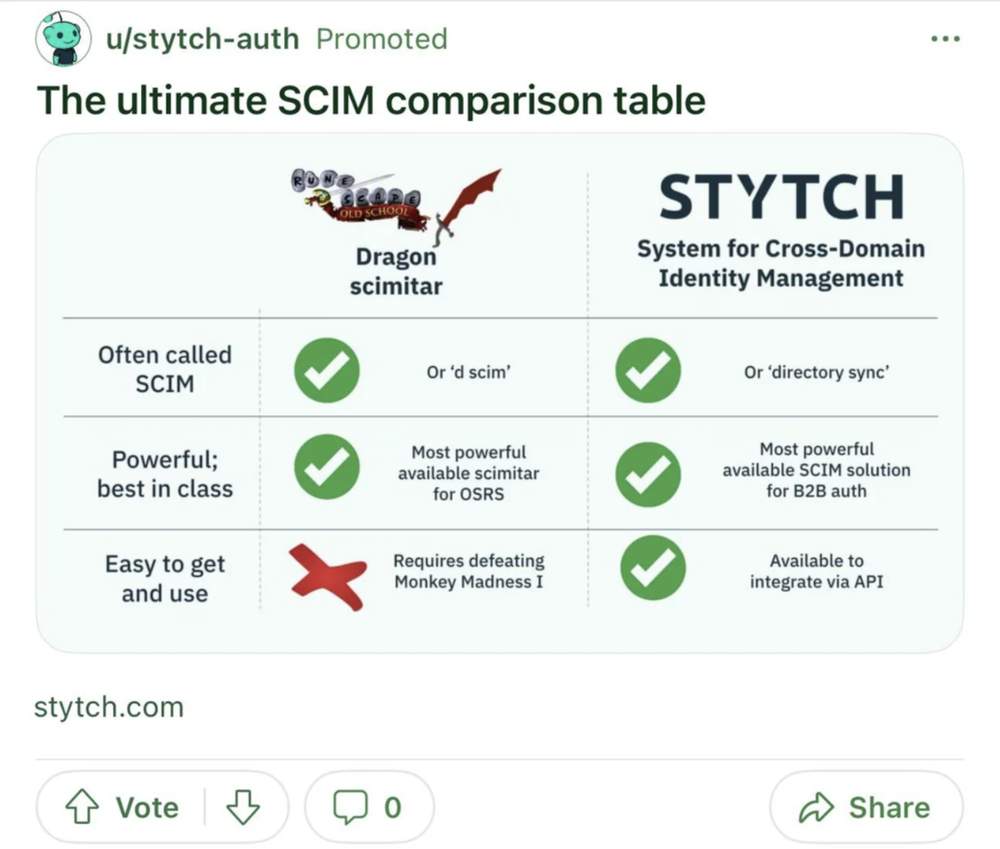
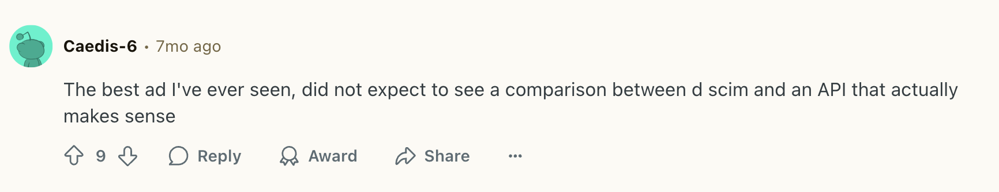
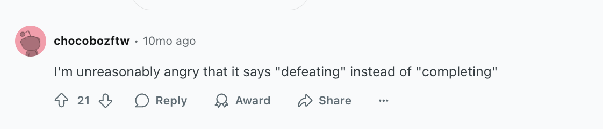

import LinkedIn from '../../components/LinkedIn.astro';

Here it is, the most successful ad I've ever run:

You may be thinking to yourself...
1. This ad is ugly and not well formatted.
2. The content doesn't even make any sense?? 

**You aren't wrong on either count!** And yet, this ad was shared organically and upvoted on Reddit, not [one](https://www.reddit.com/r/osrs/comments/1gmozj3/wtf_is_this/), not [two](https://www.reddit.com/r/2007scape/comments/1e78hj8/this_is_a_real_ad_i_just_saw_on_reddit/), but [three times](https://www.reddit.com/r/2007scape/comments/1es0pfs/these_advertisers_sure_know_how_to_grab_my/). 

While I've run other ads that were successful in different ways, this one wins for ROI because of the organic sharing and positive reception on a small budget.

I almost didn't run this ad for the same reasons I shared above: it's ugly and not well formatted, and the content doesn't make sense to most readers. But as I reflect on what made the ad a success, those two factors were actually critical:

# This Ad is Ugly and Not Well Formatted
In a world where polished and professional is the norm, unpolished authenticity stands out. 

This also requires knowing your audience: unpolished content works better on Reddit than on LinkedIn, and with software engineers than HR professionals. 

When I first had the idea for this ad, I also made a variant that was better formatted. I added color gradients and aligned boxes and used consistent iconography. But when I looked at my redesigned ad, I realized the polish took away the emotion: the surprise, the humor, the authenticity.

One company whose advertising I absolutely love is Posthog. They're a product analytics provider; it's a boring SaaS product. But their advertising is anything but boring. They feature a hedgehog as a mascot, and suprrising formats. It makes you do a double-take and feel like a real human was behind this, not a marketing agency or an AI agent.

<LinkedIn embedSrc="https://www.linkedin.com/embed/feed/update/urn:li:share:7285633482125398017" />

# The Content Doesn't Even Make Sense

I encountered the idea for this ad while I was doing SEO keyword research for Stytch's new product, SCIM. In Stytch's case, SCIM stands for System for Cross-Identity Management, a niche enterprise tool for managing user authentication and authorization. As I was researching search keywords, I was perplexed that I kept finding keywords that had seemingly nothing to do with SCIM and everything to do with dragons.

When I dug into why, I discovered that the [dragon scimitar](https://oldschool.runescape.wiki/w/Dragon_scimitar), aka 'd scim' is a weapon available in the video game Old School RuneScape. Aha!

I was amused and glad I'd solved the mystery... but then I realized therem ight be something there that I could work with. 

I also happened to know that developer audiences and gamer audiences have a lot of overlap, which was both fortunate and a reflection a lot of past customer research. I suspected that if we went viral in the gaming community, that actually wouldn't be all too bad for reaching our software engineer buyers. And I was right!

# Mistakes Helped Too!
The other thing that helped this ad succeed was that I made a mistake. I screwed up and I used the wrong term; apparently you 'complete' rather than 'defeat' Monkey Madness I in Old School RuneScape.

I'm a detail-oriented person, and normally don't like making mistakes! I ran this ad past a few software engineers on my team who do play OSRS before I posted the ad, and none of them flagged the terminology issue. So initially, when I realized the language error, I was disappointed.

But in this case, the mistake really worked in my (and the ad's) favor, because it created controversy, which in turn spawned engagement.  It made people stop and say: "Wait a second, that doesn't look right."

And so even if this looks like the marketing manager who made the ad doesn't actually play the video game (which she doesn't), the mistake helped the ad achieve more virality than it would have otherwise. A little controversy can be a powerful marketing strategy.

# What I Learned
I learned a few important things about marketing from this ad:

**Be curious!** Curiosity can be a powerful as a marketer. Going down rabbitholes and asking questions can help you deepen your understanding of your users, and also find unexpected (and valuable!) connections between ideas. 

**Know your customer.** Deep audience insight makes weird ideas work! I personally believe that all marketers should do customer interviews or listen to sales calls, or both. This helps you understand what your customer watches, reads, cares about, does for fun -- all of which help you better reach and connect with them.

**Don't be afraid to take risks.** Even B2B marketing can be fun and authentic if you're willing to put yourself out there. Not every company supports and allows this kind of risk-taking, but if they do, lean in! People are more likely to share things that surprise them.

