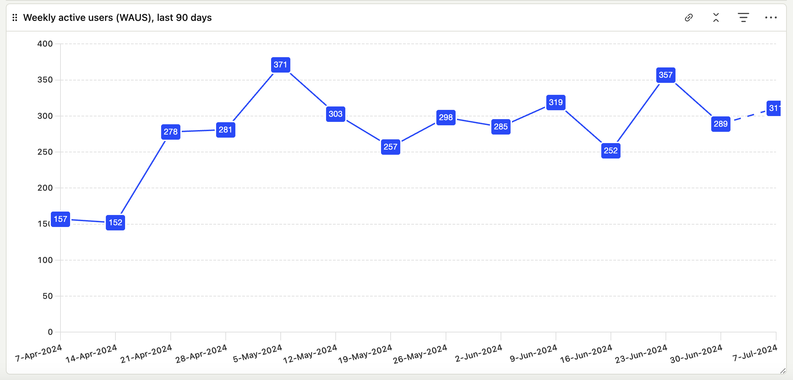
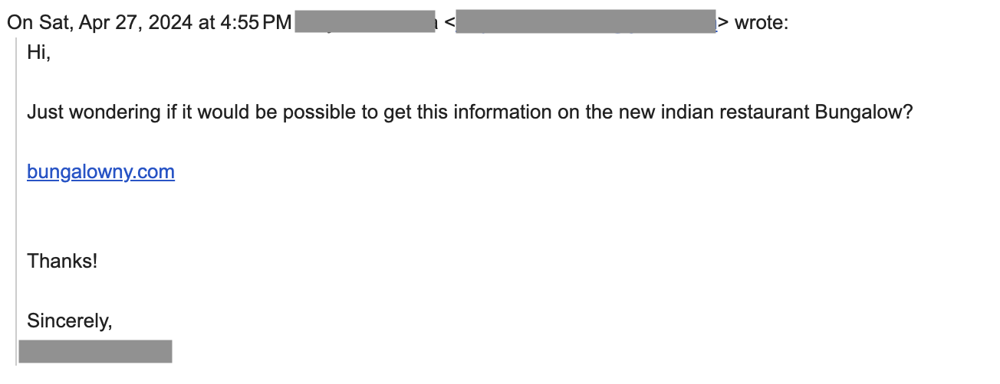

import { Image } from 'astro:assets';
import homepage from '../../assets/NYCRSVPs-homepage.png';
import datecalc from '../../assets/NYCRSVPs-calculator.png';

Recently, I built and launched [nycrsvps.com](https://www.nycrsvps.com), a very simple HTML/CSS/JS website that I built to make it easier to track and remember when reservations open at popular NYC restaurants. 

<a href="https://www.nycrsvps.com" target="_blank" rel="noopener noreferrer"><Image src={homepage} alt="Image of nycrsvps.com homepage." /></a>

It has two main pages: a [data table](https://wwww.nycrsvps.com) with when reservations open at various restaurants (shown above), and [a calculator](https://www.nycrsvps.com/reservation-open-date-calculator) to help you anticipate when reservations open for a desired date and set a reminder to book.

<a href="https://www.nycrsvps.com/reservation-open-date-calculator" target="_blank" rel="noopener noreferrer"><Image src={datecalc} alt="Image of the nycrsvps.com reservation open date calculator." /></a>

This was a fun side project that both helped me pick up some new web dev skills and helped me snag some reservations that I had been trying to make for a long time - in particular, Lilia and Raoul's. 

I wrote a bit about my takeaways from conceptualizing, creating, and launching [NYC RSVPs](https://wwww.nycrsvps.com):

## The power of open source

I minored in computer science and work for a developer tools startup that leverages open source projects in our own project, and sponsors open source projects that further the ecosystem. 

I know, on paper, the value of open source. I laugh, knowingly, at the <a href="https://www.xkcd.com/2347/" target="_blank" rel="noopener noreferrer">classic xkcd meme</a>:

But wow, the process of building this genuinely tiny website (two pages, raw HTML + JS + CSS, no frameworks) made the criticality of open source sink in.

- **Need to work with tables in HTML?** Good luck, they're super limited. I ended up using <a href="https://tabulator.info/" target="_blank" rel="noopener noreferrer">Tabulator</a>, run by Oli Folkerd.
- **Want to manipulate and format dates in JavaScript?** The Date object probably isn't going to cut it. <a href="https://moment.github.io/luxon/#/" target="_blank" rel="noopener noreferrer">Luxon</a>, which has a handful of active maintainers, including Isaac Cambron, is way better.
- **Hoping to offer scheduling?** There's a native date picker, that doesn't do much. Try <a href="https://add-to-calendar-button.com/" target="_blank" rel="noopener noreferrer">Add-To-Calendar Button</a>, maintained by Jens Kuerschner, to make that easier.

Could I have built this functionality by scratch? Maybe, but it would have taken me much, much, longer. Instead, these humans generously offered up their time and talents, so that I could do in minutes what might otherwise be immensely challenging.

Software runs on open source. I knew that, but now I *know* that. And if my two-page, no-framework, no-backend app relies this heavily on open source projects maintained by generous individuals, what does that mean for far more complex projects, and for our world's digital infrastructure? 

### Using AI to code

… is only ok. Over the course of creating NYC RSVPs, I tried out a range of AI-based coding helpers, including asking chatbots like ChatGPT and Claude, as well as experimenting with IDE-based tools like GitHub CoPilot and Cursor.

First, the (very meaningful) pros:

- **Making the project possible:** Without AI-based coding tools, this project may not have been possible. My CS minor was 5 years ago, and taught me about pointers in C and NP Hard problems, not about web development. AI was critical to getting me started and pointed in the right direction.
- **Creating an MVP, fast:** AI tools also made it really easy to get a working prototype of [the calculator](https://www.nycrsvps.com/reservation-open-date-calculator) in particular. This site requires a dropdown, a date input, a form submit, and a basic JS function. This is boilerplate JS, but that I didn't have in my head. ChatGPT generated the basics, that I then refined and styled by me with help from Cursor.
- **Asking questions without fear:** Stack Overflow and comparable forums are notoriously cutthroat. Using AI to troubleshoot or validate my ideas provided me an outlet to ask questions in a non-judgmental setting.

Next, the cons:

- **Dumb, avoidable mistakes:** I spent more time than I'm willing to admit troubleshooting an error that ChatGPT made which mixed up let vs. const. The variable was defined as a const, so wasn't changing as expected. This isn't even a CS101 mistake, this is a very-first-lesson-in-CS101 mistake, but it was much harder to catch in the context of a larger block of code that I didn't write. AI is so smart, but also sometimes it's not particularly smart at all.
- **Accessibility & readability:** The AI only has the context you provide; so if you don't give ample detail, it doesn't have ample detail to add. You end up with generic names for classes, selectors, and more; these make your code hard to parse, and also often means that accessibility best practices fall by the wayside. You have to be intentional - either in your prompting, or in your editing after the fact - to ensure these critical details are considered.

After my initial learning process, I made two big changes:

1. **Using an in-IDE AI:** I switched over to using Cursor as my primary source for AI input, which I found gave better suggestions in the context of my broader codebase vs. GitHub CoPilot and definitely vs. copy-pasting from an AI chatbot 
2. **Adapting my prompting & process:** I tried to be more thoughtful about reading through each line of the AI's code, and explicitly prompting it to include documentation and accessible, descriptive naming. That improved both my troubleshooting and the quality of my code.

In summary, AI can certainly write more code, faster, and but it's still our responsibility to make sure that it's good code.

### Just do it ✔️

I was nervous to share this project. The code and design are pretty amateur, and it was my first real foray into building something solo.

But when I shared it anonymously on Reddit, people were really encouraging! And then when my boyfriend shared it with a lot of our friends, they were super supportive, and excited to put it to use.  It was a good reminder that it's worthwhile to put yourself out there. 

Overall, I was happy with the outcomes of my Reddit launch, with the post seeing >15K views, and >1K unique visitors checking out the site. But what was cooler was getting to watch the project grow organically as more people found it and as it got more SEO traction with Google. Here's the latest visitor chart:

Some people bounce immediately, but other people use it more like I do - staying for 5, 10, 15 minutes at a time to schedule a bunch of reminders to snag reservations over the next few months. So that's pretty cool. And I even got my first user input (which, fortunately, was easy to implement, too:

### Now what?

There are a lot of different angles that I could take this project in the future if I wanted to!  A few ideas include:

- **Programmatic SEO:** In addition to posting on Reddit, would-be reservation bookers are also likely googling questions like 'What time do reservations open at Carbone?' or 'How do I get a reservation at Carbone?' I could use my data table as the basis for a programmatic SEO play where I create landing pages for each restaurant, covering these queries in hopes of beginning to rank and drawing more users to my site.
- **Adding a Back End:** Right now, the data for my project lives entirely in a JS table. This made it easy to set up, but also isn't super scalable. Because my project doesn't have any sort of back end, I also can't do things like create a form where users can submit new restaurant suggestions. A future evolution of the project could add this, as a way to better collect and store new data, and help me learn about servers, databases, and more.
- **Monetization:** Right now, my site is entirely free and open, which is great! However, for a future iteration, it could be fun to explore monetization. The most basic form might just be a 'Buy me a coffee' link, or I could explore gating access to specific restaurants or to the calculator, or I could set up Google AdSense to see if I can generate ad revenue, or I could reach out to Resy or to New York restaurants about becoming sponsors. All of these depend on my ability to prove that I can sustain quality traffic to the site, though!
- **Improving Data Robustness:** I can also continue to expand the restaurant base, or add new data features! Two good examples might be: (1) capturing when restaurants are not open on a specific day of the week (e.g. building in support for the fact that Jeju Noodle Bar isn't open on Mondays or Tuesdays), and (2) adding support for restaurants that open their reservations on the first day of the month, rather than X days in advance. Neither of these are currently supported, and would require me to upgrade my calculations and data structures to make sure these dimensions are captured accurately.