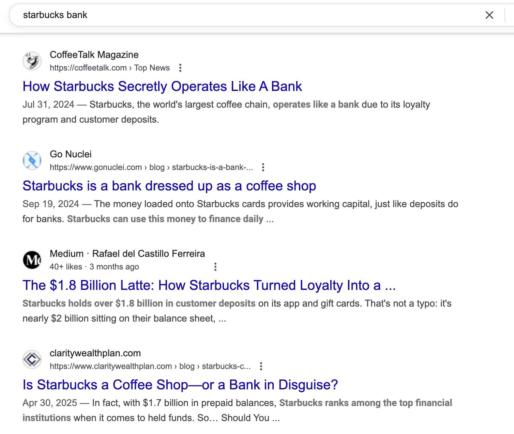
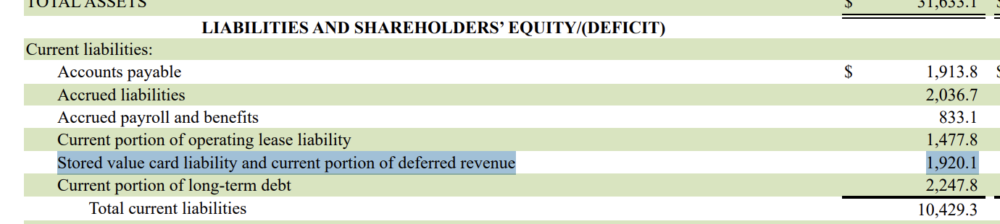
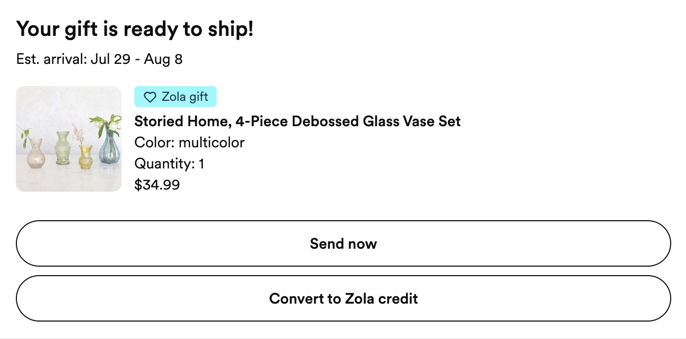
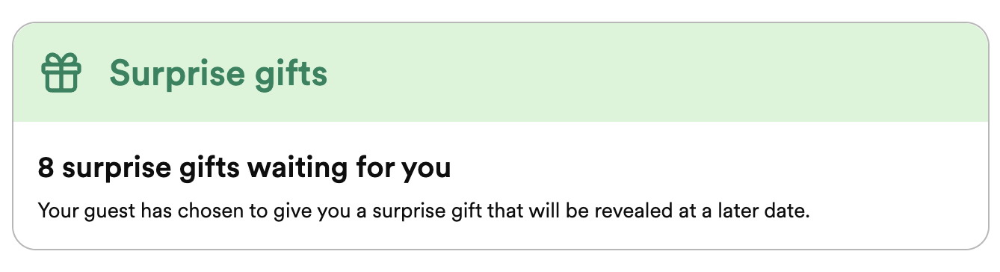

import Aside from '../../components/Aside.astro';
import MDXStyles from '../../components/MDXStyles.astro';

A weird and unexpected side effect of business school is that I find myself thinking about cash flows a lot. They’re a staple of finance exams, of course, but they also show up everywhere else: In accounting, you manage working capital to protect cash flow. In entrepreneurship, you're worried about having enough runway to launch. In negotiations, payment terms matter because they determine when cash comes in and out.

So with cash flows already top of mind (and because I’m planning a wedding), I was surprised to realize: Zola (and other wedding registries) are basically banks.

## What is a bank?

Let's first define what a bank is. A bank:
- Accepts deposits from customers
- Uses those deposits to make loans or investments
- Offers financial services like transfers, credit, or safekeeping

There are legal and regulatory layers too (FDIC oversight, capital requirements), but we'll focus on the economic function rather than the formal structure.

Within the 'deposit' category, most banks also accept both 'demand deposits' and 'term deposits':
- **Demand deposits:** funds you can withdraw at anytime (like checking accounts)
- **Term deposits:** funds locked up for a set period (like CDs or fixed deposits)

In addition to the regulated financial institutions we know and love, as it turns out, there are lots of other companies who operate like banks—storing customer funds, earning interest on float, and facilitating money movement—without calling themselves that.

## The Starbucks example

Starbucks is the canonical example of this:

I went back in time to find out when this first was revealed, and [a 2014 Wired article](https://www.wired.com/2014/03/next-big-thing-missed-starbucks-next-bank/) seems to be among the earliest references, shortly followed by deeper dives like [this 2016 piece](https://www.amminvest.com/starbucks-sbux-float/) highlighting the then-$1B of customer cash on Starbucks' balance sheet, which earned $20M in interest that year alone.

As of Q2 2025, Starbucks is holding $1.92B (yes, billion!) in stored value (gift cards and app balances). That’s more than many small banks.

From Starbucks' financial statements: stored value:

Here's what makes this particularly bank-like:
- **Stored value:** Starbucks stores customer money in the form of gift cards and app balances. 
- **Interest-free float:** Starbucks doesn’t pay interest on this stored cash. It gets to use the money as working capital, essentially borrowing for free. It can then invest the cash, earning interest of its own.
- **Closed-loop system:** As it turns out, being Starbucks is actually even better than being a bank. Since the money can only be spent at Starbucks, it’s not subject to bank-like withdrawal pressures. It’s a controlled financial ecosystem.

Starbucks' [Q2 2025 earnings](https://s203.q4cdn.com/326826266/files/doc_financials/2025/q2/4e0ba8df-2038-49f2-8104-e23bd30db708.pdf) shows $28.4M in interest income. Even accounting for other investments, a good chunk of that is profit from storing and investing customer cash.

## Back to Zola: The Wedding Registry Bank

So, how is Zola a bank? 

### Demand deposits

When a guest buys a gift on Zola, they pay right away. But I, as the bride, don’t receive the item immediately. Instead, Zola holds the funds until I choose to “send” the gift.

This is similar to buying a gift card at Starbucks, or placing cash in a bank account; it's effectively a **demand deposit**. I can initiate the “withdrawal” (shipping) whenever I want, but until then, Zola holds the cash.

Here's an example gift, which right now is acting as a $34.99 deposit at Zola bank:

Zola even offers the option to convert that gift into Zola credit, keeping the funds in its ecosystem longer.

### Time bound deposits

But it doesn't stop there: Zola actually also offers **'term deposits'** as well. Those are 'surprise gifts', which Zola markets as a charming option for guests who want to pre-pay for a gift but keep it a surprise until the wedding day. This is a win-win: for the guest, it feels thoughtful and fun, and for Zola, it acts as a **time-bound, interest-free loan.** 

They know exactly when the funds will be needed (no sooner than the wedding date), and can invest or use the money until then.

### Financial services

Zola also offers other financial services, too. For example, couples can:
- Withdraw funds to their own bank accounts
- Buy gift cards (transferring funds to other “banks” like Amazon or Delta)
- Collect cash contributions (on which Zola takes a cut)
- Purchase from third-party vendors (with Zola taking a marketplace commission)

## In Conclusion

Zola's offers a great user experience for couples, but behind the scenes, it's running a surprisingly effective bank. 

Unfortunately, Zola’s financials are private, so we don’t know how much cash they hold or how much interest they earn. But based on the model, it’s probably substantial.

Starbucks may have popularized the concept of being a secret bank. But Zola shows the model works far beyond coffee. Wedding registries, it turns out, are a pretty good gig for cash flow. J.P. Morgan & Wells Fargo, please take notes!
